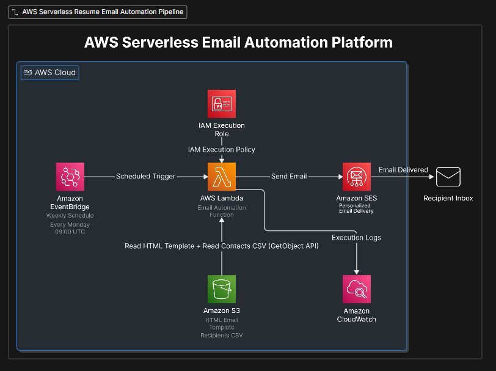
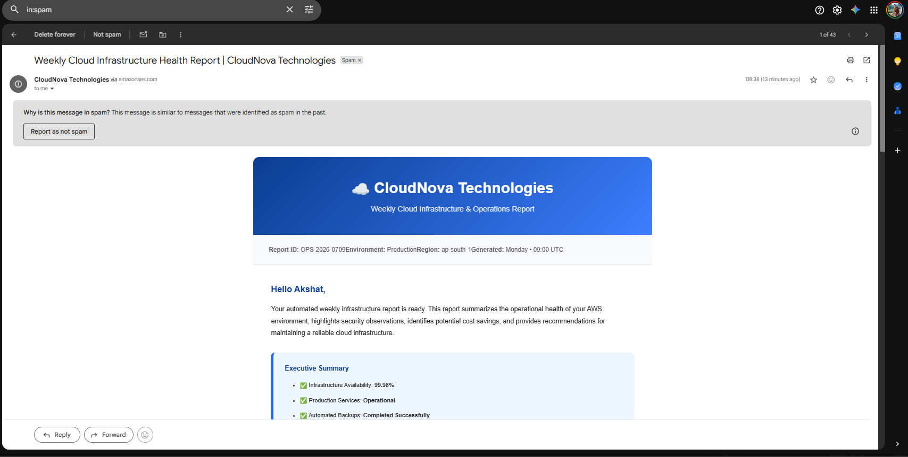
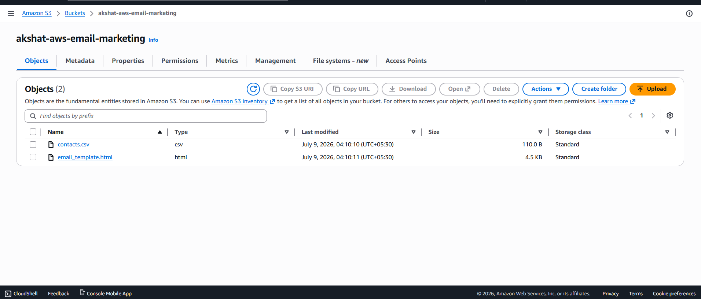
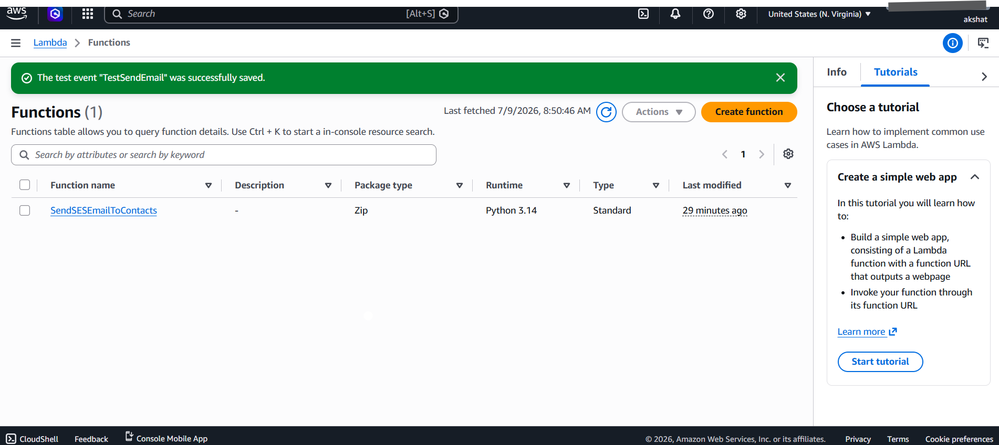
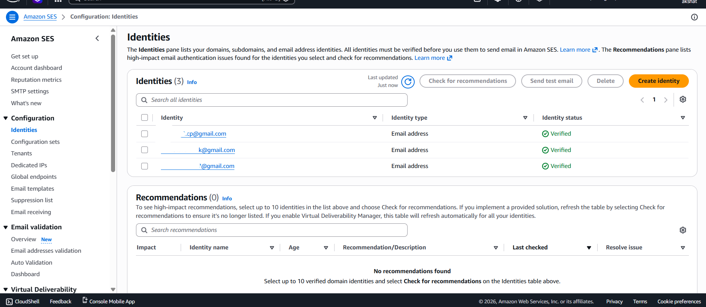
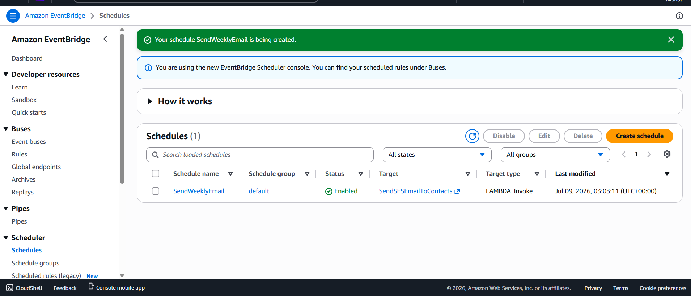
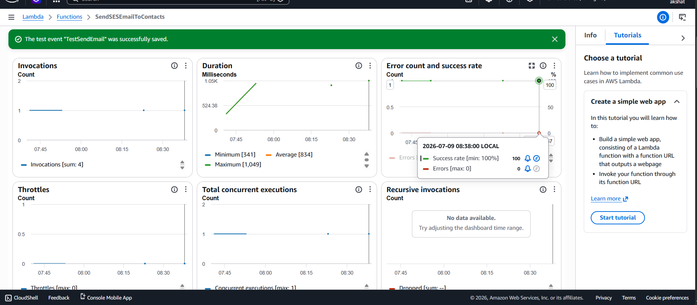

# ☁️ AWS Serverless Email Automation Platform


## 📌 Project Overview

The **AWS Serverless Email Automation Platform** is a fully serverless cloud application that automates the delivery of personalized HTML emails using Amazon Web Services.

The platform retrieves an HTML email template and recipient information stored in Amazon S3, generates personalized emails using AWS Lambda, and delivers them through Amazon Simple Email Service (SES). Email delivery is automatically scheduled using Amazon EventBridge, while Amazon CloudWatch provides execution logging and monitoring.

This project demonstrates how multiple AWS services can be integrated to build a scalable, event-driven automation workflow without managing any servers.

---

## 🚀 Key Features

- Automated email delivery using Amazon SES
- Fully serverless architecture
- Scheduled execution using Amazon EventBridge
- HTML email templates stored in Amazon S3
- Recipient list managed through CSV files
- Personalized emails using placeholder replacement
- IAM-based secure access control
- CloudWatch logging for monitoring and debugging
- Modular architecture for easy extension
- Production-style AWS service integration

---

# 🏗️ Architecture



---

# ⚙️ Architecture Workflow

1. Amazon EventBridge triggers the AWS Lambda function based on a scheduled rule.

2. AWS Lambda retrieves:
   - HTML email template
   - Recipient CSV file
   from Amazon S3.

3. Lambda personalizes the HTML template for each recipient.

4. Lambda invokes Amazon SES to send the emails.

5. Amazon SES delivers the personalized emails to verified recipients.

6. Amazon CloudWatch records execution logs for monitoring and troubleshooting.

---

# ☁️ AWS Services Used

| Service | Purpose |
|----------|---------|
| Amazon S3 | Stores the HTML email template and recipient CSV file |
| AWS Lambda | Processes recipient data and sends personalized emails |
| Amazon SES | Sends personalized HTML emails |
| Amazon EventBridge | Triggers Lambda automatically on a schedule |
| Amazon IAM | Provides secure permissions for Lambda |
| Amazon CloudWatch | Stores execution logs and monitoring information |

---

# 📂 Project Structure

```text
aws-serverless-email-automation-platform/
│
├── README.md
├── SETUP-GUIDE.md
├── AWS-SERVICES.md
├── ARCHITECTURE.md
│
├── architecture/
│   └── architecture-diagram.png
│
├── screenshots/
│   ├── email-preview.png
│   ├── lambda.png
│   ├── ses.png
│   ├── s3.png
│   ├── eventbridge.png
│   └── cloudwatch.png
│
├── lambda/
│   └── lambda_function.py
│
├── templates/
│   └── weekly_cloud_report_template.html
│
└── contacts/
    └── cloud_report_recipients.csv
```

---

# 📸 Project Screenshots

## HTML Email Preview



---

## Amazon S3

Upload and manage the HTML email template and recipient CSV.



---

## AWS Lambda

Lambda function responsible for generating and sending personalized emails.



---

## Amazon SES

Verified identity used to deliver emails securely.



---

## Amazon EventBridge

Weekly scheduled trigger that invokes the Lambda function.



---

## Amazon CloudWatch

Execution logs generated by Lambda for monitoring and debugging.



---

# 🛠️ Technologies Used

- Python 3
- AWS Lambda
- Amazon SES
- Amazon S3
- Amazon EventBridge
- Amazon CloudWatch
- Amazon IAM
- HTML
- CSV
- Boto3 (AWS SDK for Python)

---

# 📋 Prerequisites

Before deploying this project, ensure you have:

- AWS Account
- Python 3.x
- AWS CLI configured
- Verified Amazon SES email identity
- IAM Role with required permissions
- Amazon S3 Bucket
- Basic knowledge of AWS services

---

## 🚀 Installation

### 1. Clone the Repository

```bash
git clone https://github.com/AkshatStark06/AWS-Email-Automation-System.git
cd AWS-Email-Automation-System
```

---

### 2. Create an Amazon S3 Bucket

Create an S3 bucket to store:

- HTML Email Template
- Recipient CSV File

Example structure:

```text
templates/
└── weekly_cloud_report_template.html

contacts/
└── cloud_report_recipients.csv
```

Upload both files to the bucket.

---

### 3. Verify an Email Identity in Amazon SES

1. Open Amazon SES.
2. Navigate to **Configuration → Identities**.
3. Create an **Email Address Identity**.
4. Verify the email address.
5. (Optional) Request production access if sending emails outside the SES sandbox.

---

### 4. Create an IAM Role

Create an IAM Role for Lambda with permissions to:

- Read objects from Amazon S3
- Send emails using Amazon SES
- Write logs to Amazon CloudWatch

---

### 5. Deploy the Lambda Function

Create a new Lambda function.

Upload:

```text
lambda/
└── lambda_function.py
```

Configure:

- Runtime: Python 3.x
- Execution Role: IAM Role created earlier

---

### 6. Configure EventBridge

Create a scheduled EventBridge Rule.

Example schedule:

```text
Every Monday
09:00 UTC
```

Set the Lambda function as the target.

---

# ⚙️ Configuration

Update the following variables inside the Lambda function.

```python
BUCKET_NAME = "your-s3-bucket-name"

TEMPLATE_FILE = "templates/weekly_cloud_report_template.html"

CONTACT_FILE = "contacts/cloud_report_recipients.csv"

SOURCE_EMAIL = "CloudNova Technologies <your_verified_email@gmail.com>"
```

---

# ▶️ Running the Project

Once configured:

1. Upload the HTML template to Amazon S3.
2. Upload the recipient CSV file.
3. Trigger Lambda manually or wait for EventBridge.
4. Lambda downloads the template and recipient list.
5. Personalized emails are generated.
6. Amazon SES sends the emails.
7. CloudWatch stores execution logs.

---

# 📧 Email Workflow

```text
Amazon EventBridge
        │
        ▼
AWS Lambda
        │
        ├── Read HTML Template
        ├── Read Contacts CSV
        ▼
Amazon S3
        │
        ▼
Generate Personalized Emails
        │
        ▼
Amazon SES
        │
        ▼
Recipient Inbox
```

---

# 🧪 Testing

The application can be tested by:

- Invoking the Lambda function manually.
- Uploading an updated HTML template.
- Updating the recipient CSV.
- Verifying email delivery.
- Reviewing CloudWatch logs.

---

# 🔒 Security Considerations

- IAM follows the Principle of Least Privilege.
- HTML templates remain securely stored in Amazon S3.
- Amazon SES requires verified identities.
- CloudWatch provides centralized execution logging.
- Sensitive credentials are never hardcoded.

---

# 📚 Learning Outcomes

This project demonstrates practical experience with:

- Serverless Architecture
- Event-Driven Computing
- AWS Lambda
- Amazon SES
- Amazon S3
- Amazon EventBridge
- IAM Roles and Policies
- CloudWatch Monitoring
- HTML Email Automation
- Python Automation using Boto3

---

# 🚀 Future Improvements

Potential enhancements include:

- Dynamic email templates stored in DynamoDB
- Attachment support
- Multi-language email templates
- Email analytics and delivery tracking
- Bounce and complaint handling
- Dead Letter Queue (DLQ) integration
- SNS notifications
- CloudFormation or Terraform deployment
- CI/CD using GitHub Actions
- Support for multiple email campaigns

---

# 💼 Resume Highlights

- Designed and deployed a fully serverless email automation platform using AWS.
- Automated personalized email delivery using Amazon SES and AWS Lambda.
- Scheduled recurring workflows with Amazon EventBridge.
- Implemented secure access using IAM Roles and Policies.
- Stored email templates and recipient data in Amazon S3.
- Configured CloudWatch for centralized monitoring and execution logging.
- Built a scalable event-driven architecture following AWS best practices.

---

# 🤝 Contributing

Contributions, suggestions, and improvements are welcome.

If you would like to improve this project:

1. Fork the repository.
2. Create a feature branch.
3. Commit your changes.
4. Open a Pull Request.

---

# 📄 License

This project is licensed under the MIT License.

---

# 👨‍💻 Author

**Akshat Srivastava**

B.Tech Electrical & Electronics Engineering

Cloud • Data Analytics • Machine Learning

If you found this project useful, consider giving it a ⭐ on GitHub.

---
